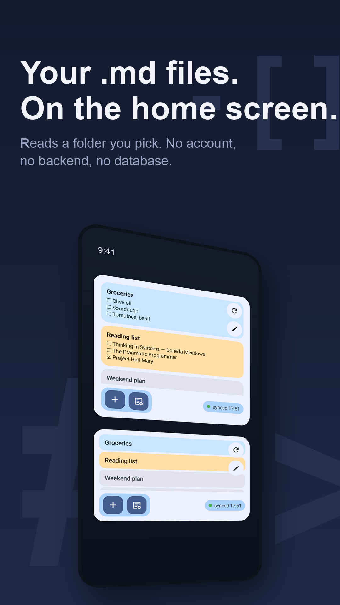
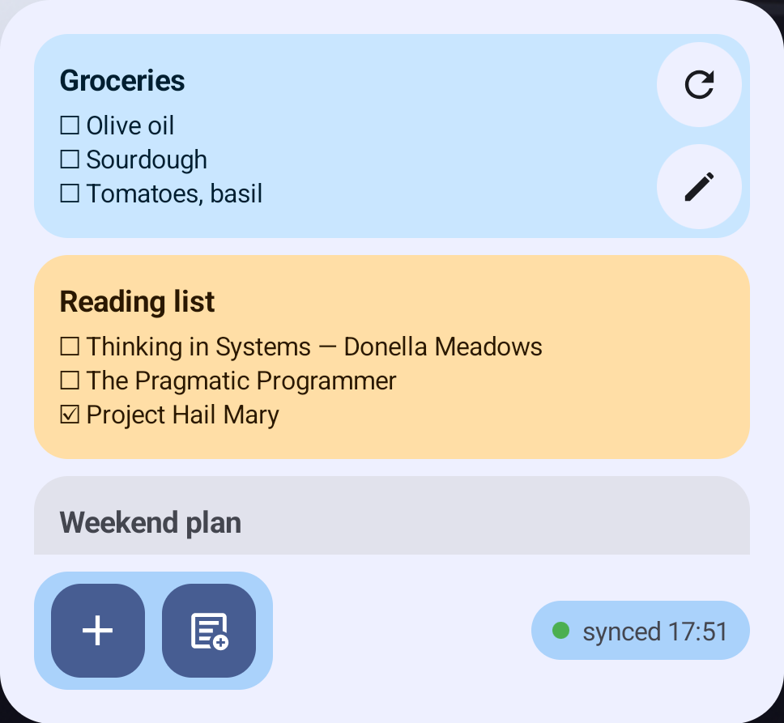
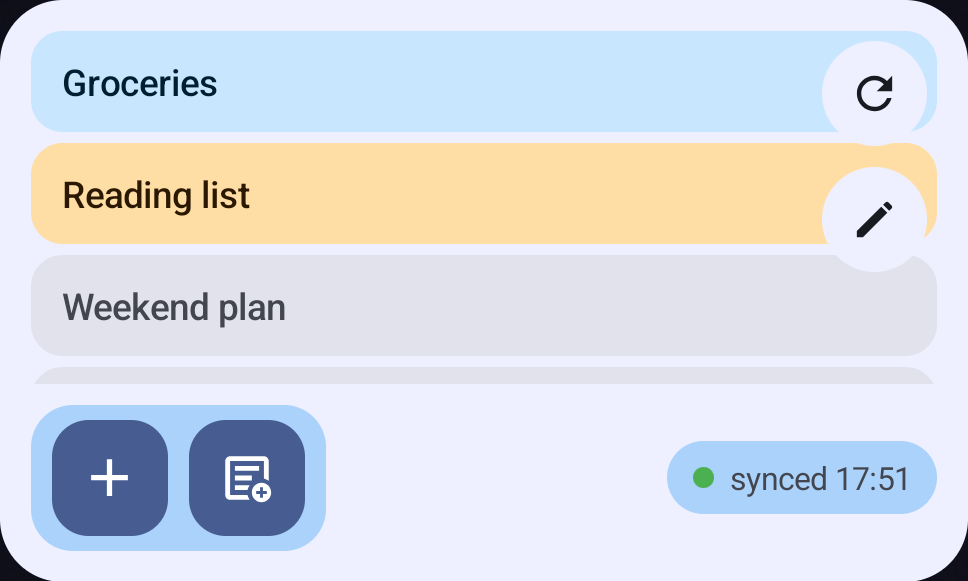

<p align="center">
  
</p>

<h1 align="center">Notes Widget for Markdown</h1>

<p align="center">
  Your Markdown notes on the Android home screen — and a chip that tells you when git sync broke.<br>
  <sub>No account. No backend. The F-Droid build cannot reach the network at all.</sub>
</p>

<p align="center">
  <a href="#install">Install</a> ·
  <a href="#how-to-use-it">How to use it</a> ·
  <a href="#sync-status">Sync status</a> ·
  <a href="#privacy">Privacy</a> ·
  <a href="https://github.com/marfolog/notes-widget-for-markdown/discussions">Discussions</a> ·
  <a href="LICENSE">MIT</a>
</p>

---

## What you get

<p align="center">
  
  &nbsp;&nbsp;
  
</p>

**Two widgets over the same folder.** Cards render a preview of each note — headings, links, lists,
task checkboxes. The compact list shows just names, so more notes fit. Tapping a note opens it in
Obsidian.

**A sync chip that means something.** It reads the vault's `.git` and says `synced 17:51`,
`sync stuck` when a merge or rebase was left half-finished, or `not pushed` when your branch drifted
from `origin`. Nothing else on your phone tells you sync quietly stopped.

**Notes that stay yours.** Plain `.md` files in a folder you pick, read through Android's Storage
Access Framework. Nothing is copied, converted or uploaded.

**Cards you can arrange.** Per-note height, text size and colour; drag to reorder; delete a file
straight from settings. New notes appear at the top within seconds of landing on disk.

## Install

No Play Store or F-Droid listing yet.

1. Download the APK from [Releases](https://github.com/marfolog/notes-widget-for-markdown/releases)
   — take the `foss` one unless you want the Play build's crash reporting.
2. Allow installs from unknown sources when Android asks.
3. Requires Android 11 (API 30) or newer.

Every release lists a SHA-256 so you can check what you downloaded.

## How to use it

1. Open the app and pick the **root of your vault** — the folder holding `.obsidian` and, if you sync
   with git, `.git`.
2. Pick the **notes folder** the widget should show. It can be the root or any subfolder.
3. Add either widget to your home screen and resize it.
4. Tap the pencil on the widget to come back and set card colours, sizes and order.

Tapping a note opens it in Obsidian and the **+** button creates one there. Everything else —
reading, previewing, ordering, deleting — works without Obsidian installed.

## Sync status

If the vault is a git repository, the widget reports what git last did. The app **never runs git**
and never touches the network. It only reads plain-text files every git client writes:

| File | What it tells us |
| --- | --- |
| `logs/HEAD` | the last commit, pull, merge or checkout, and when |
| `FETCH_HEAD` | when a client last contacted the remote (timestamp only) |
| `index` | that a client is alive, even with nothing to transfer (timestamp only) |
| `MERGE_HEAD`, `rebase-merge`, `rebase-apply` | a merge or rebase that stopped — in practice a conflict |
| `HEAD`, `refs/**`, `packed-refs` | the current branch, and whether it matches `origin` |

Commit contents, `config`, remote URLs and credentials are never read. Because this is ordinary git
plumbing, it behaves the same with CLI git, Obsidian Git or Git Sync.

Two things worth knowing. The reflog only moves when something actually transfers, so a quiet vault
is normal rather than broken. And Storage Access Framework cannot look above a folder you granted —
if `.git` sits one level up, the app asks for that folder too. Not using git? Switch the chip off in
settings and nothing under `.git` is read at all.

## Privacy

The app ships in two flavours, and they differ in exactly one thing — whether anything leaves your
phone.

| | `foss` — GitHub, F-Droid | `play` — Google Play |
| --- | --- | --- |
| `INTERNET` permission | **no** | yes |
| Analytics | none | Firebase, app usage only |
| Crash reports | none | Firebase Crashlytics |
| Can be switched off | nothing to switch off | yes, in settings |

**The foss build declares no `INTERNET` permission, so Android will not let it open a network
connection of its own.** That is not a promise I am making — it is a property of the file you
download, enforced by the operating system, and you can check it yourself:
`aapt dump permissions app-foss-release.apk`. Opening a note still hands its location to Obsidian,
which is what the tap is for.

The app is built on roughly 190 third-party libraries, almost all of them AndroidX. I have not
audited them and cannot vouch for what any of them does — nobody shipping an Android app can. What
I can point at is the missing network permission above, and the dependency list in
[`docs/dependencies-foss.txt`](docs/dependencies-foss.txt), so you can judge for yourself.
It does ask for `WAKE_LOCK`, `ACCESS_NETWORK_STATE`, `RECEIVE_BOOT_COMPLETED` and
`FOREGROUND_SERVICE` — those come from WorkManager, which schedules the widget refresh, and none of
them can move data off the device.

The Play build reports app and crash events, so installs outside Play are visible at all. It can be
switched off in settings, and it never sends note contents, file names or folder paths — storage
locations are stripped from crash breadcrumbs before they leave the device. No advertising ID is
collected, and the ad-related permissions Firebase would normally add are removed from the manifest.

Neither build has an account, a server or a database. Files are read only in folders you picked.

Full text: [Privacy Policy](https://folmbuild.cz/notes-widget-privacy/).

## Limitations

- Not an official Obsidian plugin, and not affiliated with Obsidian.
- Reports sync state, never performs it — pulling and pushing stays with your client.
- No editing inside the widget; opening and creating go through Obsidian deep links.
- Android widgets cannot render full Markdown, so previews are simplified.
- English only for now; strings are still hardcoded in Kotlin.
- For Obsidian Sync, Syncthing and similar there is no status — those clients keep their state in
  private app storage no other app can read.

<details>
<summary><b>Build from source</b></summary>

Needs Android Studio, JDK 17+ and the API 36 SDK.

There are two flavours: `foss` (no Firebase, no `INTERNET`) and `play` (analytics and crash
reporting). Build the one you want.

```bash
./gradlew assembleFossDebug    # debug APK, no telemetry
./gradlew assemblePlayDebug    # debug APK with Firebase
./gradlew testFossDebugUnitTest
./gradlew installFossDebug     # install on a connected device
./gradlew assembleFossRelease  # release APK
```

Release builds are unsigned unless you supply `RELEASE_STORE_FILE`, `RELEASE_STORE_PASSWORD`,
`RELEASE_KEY_ALIAS` and `RELEASE_KEY_PASSWORD` through local Gradle properties or environment
variables. Never commit keystores or passwords.

Tagging `vX.Y.Z` builds and signs both flavours in GitHub Actions and attaches them to a Release
with their SHA-256 sums. The release fails if the foss APK ever gains the `INTERNET` permission —
the privacy claim is enforced by the pipeline, not by memory.

</details>

<details>
<summary><b>How it is built</b></summary>

Kotlin, Gradle Kotlin DSL, Jetpack Compose for settings, Jetpack Glance for the widgets, Koin,
Coroutines and Flow, Storage Access Framework via `DocumentFile`, CommonMark for the preview, and
WorkManager plus a JobScheduler content trigger for refreshes.

The rules the code sticks to: the file system is the source of truth, no database for note content,
no account, no cloud, and platform APIs over file-access hacks.

</details>

<details>
<summary><b>Roadmap</b></summary>

Next: first signed public release · strings moved to `strings.xml` so it can be translated · a
"last changed" time for folders that are not git repositories · configurable non-Obsidian editors ·
better empty and error states.

Later: F-Droid metadata · a grid layout for the card widget · nested folders · an accessibility pass
over widget contrast and touch targets.

</details>

## Feedback and contributing

- **Something broken?** [Open a bug report](https://github.com/marfolog/notes-widget-for-markdown/issues/new?template=bug_report.yml).
  The foss build reports nothing anywhere, so a report from you is the only way a crash is ever seen.
  The form asks for your launcher and sync client because widget bugs almost always depend on them.
- **Want something?** [Open an idea](https://github.com/marfolog/notes-widget-for-markdown/issues/new?template=feature_request.yml)
  or bring it to [Discussions](https://github.com/marfolog/notes-widget-for-markdown/discussions)
  if it is still half-formed.

Pull requests are welcome. Most useful right now: testing against real vaults, Markdown preview edge
cases, and launcher compatibility reports — widgets behave differently on Pixel, One UI and Nova,
and I can only test one. Please open an issue before a large pull request.

## No warranty

This is a free, MIT-licensed hobby project maintained by one person in his spare time. It comes
**as is, without warranty of any kind**, and you use it at your own risk. Two things deserve saying
plainly rather than hiding in the licence text:

- **Deleting a note from settings deletes the file.** There is no trash to recover it from. If your
  vault is not backed up or version-controlled, it is gone.
- **The sync chip is informational.** It reports what it can read from `.git`, and it can be wrong
  or out of date — a client may write state the app does not understand. Never treat a green chip
  as proof that your notes are safely synced; check your git client when it matters.

Nothing here excludes liability where the law does not allow it to be excluded.

## License

MIT — see [LICENSE](LICENSE). That licence also disclaims warranty and liability; the section above
just says the same thing in plain words.
