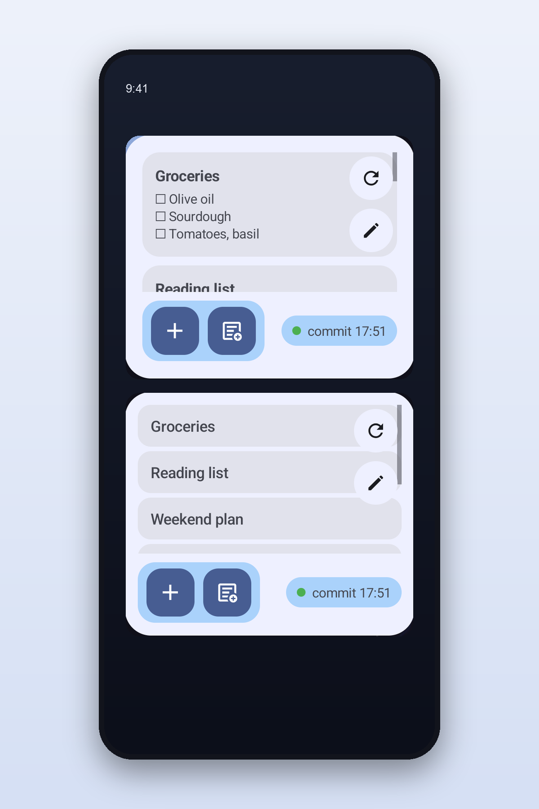

# Notes Widget for Markdown

An Android home screen widget for local Markdown notes.

Notes Widget for Markdown is built for people who keep their notes as plain `.md` files and want a fast, glanceable, Google Keep-like view on their Android home screen. It works especially well as a companion for an Obsidian vault, but the note preview itself is not tied to Obsidian storage or sync. Your files stay in your folder; the app reads them directly.

> Early project status: usable prototype / MVP. APIs, settings, and visual design may still change.

## What It Does

- Shows Markdown notes in a scrollable Android home screen widget.
- Reads notes directly from a user-selected folder using Android Storage Access Framework.
- Keeps the file system as the source of truth. No database, account, cloud backend, or proprietary note format.
- Generates a clean preview from Markdown, including headings, links, lists, and task checkboxes.
- Opens notes in Obsidian when tapped, using Obsidian deep links.
- Creates a new note through Obsidian from the widget add button.
- Appends quick Fast notes directly to a selected local Markdown file.
- Ships two widgets, both reading the same folder:
  - **cards** with a Markdown preview of each note
  - **compact list** of note names, for fitting more on screen
- Shows the state of your git sync in a small chip: the last pull or commit, a merge or rebase your
  sync client left unfinished, or a branch that has drifted from `origin`. See
  [Git sync status](#git-sync-status) for exactly what is read.
- Refreshes within seconds of the folder changing, so a note written in Obsidian or pulled by a
  sync client shows up without waiting for the next update cycle.
- Lets you customize each note card:
  - card height, including an extra-large size
  - text size
  - preset or custom color
  - order, by dragging notes in settings
- Deletes a note file from settings, behind a confirmation.
- Hides Obsidian folder notes (a file named like its parent folder), matching what Obsidian shows.
- Newly added Markdown files appear at the top with default styling until you configure them.

## Screenshots



More in [`docs/screenshots/`](docs/screenshots/): each widget on its own, and the settings screens.
All of them use a throwaway demo vault, never real notes.

## Install

There is no Play Store or F-Droid listing yet. Grab the APK from the
[Releases page](https://gitlab.com/Marfolog/notes-widget-for-markdown/-/releases), allow installs
from unknown sources when Android asks, and open the app once to pick your notes folder.

Requires Android 11 (API 30) or newer. Every release lists the APK's SHA-256 so you can verify what
you downloaded.

## Git sync status

If your vault is a git repository, the widget shows what git last did. The app **never runs git**
and never touches the network — it only reads plain-text files that every git client writes:

| File | What it tells us |
| --- | --- |
| `.git/logs/HEAD` | the last commit, pull, merge or checkout, and when |
| `.git/FETCH_HEAD` | when a client last contacted the remote (modification time only) |
| `.git/index` | that a client is running at all, even with nothing to transfer (modification time only) |
| `.git/MERGE_HEAD`, `.git/rebase-merge`, `.git/rebase-apply` | a merge or rebase that stopped — in practice, a conflict |
| `.git/HEAD`, `.git/refs/**`, `.git/packed-refs` | the current branch, and whether it matches `origin` |

It does not read commit contents, `.git/config`, remote URLs or credentials. Because all of this is
ordinary git plumbing rather than any client's private format, it works the same with CLI git,
Obsidian Git, Git Sync or anything else.

Storage Access Framework cannot look above a folder you granted, so if `.git` sits one level above
your notes folder, the app asks for that folder too — and it searches every folder you have granted
it for a `.git`. If you sync some other way, switch the chip off in settings and nothing under
`.git` is read at all.

## Privacy

- The manifest declares **no Android permissions**, not even `INTERNET`. The app cannot phone home.
  Verify it yourself: `aapt dump permissions app-release.apk`.
- No analytics, no crash reporting, no account, no server, no database.
- Files are read through the Storage Access Framework, only in folders you explicitly picked, and
  only when the widget renders.
- Nothing is copied anywhere. Your notes stay where they are.

## Why

Obsidian and many other note apps are great for writing, linking, and organizing Markdown. Android widgets are great for quickly seeing what matters without opening an app.

This project sits between those worlds:

- Obsidian or another Markdown editor remains the writing tool.
- Your local Markdown folder remains the source of truth.
- The Android widget becomes a lightweight visual layer for quick access.

The design goal is a practical note board, not a full Markdown editor.

## Current Limitations

- This is not an official Obsidian plugin.
- It does not sync anything. It only reads `.git` to report state — pulling and pushing stays with
  your own client. See [Git sync status](#git-sync-status).
- It does not edit Markdown content inside the widget.
- Android widgets cannot render full Obsidian/Markdown layout like the app itself can.
- Only local folders accessible through Android Storage Access Framework are supported.
- There is no Play Store or F-Droid listing yet; releases are APKs on the Releases page.
- All user-visible text is English and hardcoded, so the app cannot be translated yet.
- For non-git setups (Obsidian Sync, Syncthing) there is no sync status: those clients keep their
  state in their own private app storage, which no other app can read.
- Obsidian is currently required for tap-to-open and add-new-note actions.

## Setup

1. Install the app on Android 11 or newer.
2. Open the app.
3. Select the root of your Obsidian vault or Markdown folder.
4. Select the folder that contains the `.md` files you want in the widget.
5. Add the widget to your Android home screen.
6. Optional: open the app settings again to customize card size, color, text size, and order.

## Works Without Obsidian

Yes, for the core preview flow:

- selecting a local Markdown folder
- reading `.md` files
- showing note cards in the widget
- customizing card size, text size, color, and order
- appending Fast notes to a selected Markdown file

Obsidian is currently used for editor actions:

- tapping an existing note opens it in Obsidian
- tapping the add button starts a new note in Obsidian

Support for configurable non-Obsidian editor actions is on the roadmap.

## Obsidian Integration

The app delegates note opening and note creation to Obsidian using URI links:

- tapping an existing note opens it in Obsidian
- tapping the add button starts a new note in Obsidian

If you use another Markdown editor, the file preview still works, but editor-specific deep links may need future support.

## Supported Devices

- Minimum Android version: Android 11 (API 30).
- Target SDK: Android 16 / API 36.
- Tested by the maintainer on Pixel 10 running Android 16.

Please report launcher/widget compatibility issues with device model, Android version, launcher name, and whether battery optimization is enabled.

## Build From Source

Requirements:

- Android Studio
- JDK 17 or newer
- Android SDK with API 36

Build a debug APK:

```bash
./gradlew assembleDebug
```

Run unit tests:

```bash
./gradlew testDebugUnitTest
```

Install a debug build on a connected device:

```bash
./gradlew installDebug
```

Build a release APK:

```bash
./gradlew assembleRelease
```

Unsigned release builds are expected when no release signing config is provided. For signed releases, provide these values through local Gradle properties or environment variables:

- `RELEASE_STORE_FILE`
- `RELEASE_STORE_PASSWORD`
- `RELEASE_KEY_ALIAS`
- `RELEASE_KEY_PASSWORD`

Do not commit keystores, passwords, tokens, or local signing properties.

## Release Process

The first public release target is a signed APK attached to a GitLab Release.

For GitLab CI, configure these protected and masked variables:

- `ANDROID_KEYSTORE_BASE64`
- `ANDROID_KEYSTORE_PASSWORD`
- `ANDROID_KEY_ALIAS`
- `ANDROID_KEY_PASSWORD`

Create a tag such as `v0.1.0`. The pipeline runs unit tests, builds the signed release APK, creates a SHA-256 checksum, uploads both files to GitLab Generic Packages, and creates a GitLab Release using `RELEASE_NOTES.md`.

## Tech Stack

- Kotlin
- Gradle Kotlin DSL
- Jetpack Compose for the setup UI
- Jetpack Glance for the home screen widget
- Koin for dependency injection
- Kotlin Coroutines and Flow
- Android Storage Access Framework via `DocumentFile`
- CommonMark for Markdown preview parsing
- WorkManager for periodic widget refresh

## Project Principles

- Local-first by default.
- Plain Markdown files remain the source of truth.
- No Room database for note content.
- No account system.
- No cloud backend.
- Android platform APIs over custom file access hacks.
- Obsidian integration should be helpful but optional where possible.

## Roadmap

Near-term:

- Publish the first signed public APK release.
- Move user-visible strings into `strings.xml` so the app can be translated.
- Show a "last changed" time for folders that are not git repositories, which is the only sync
  signal readable for Obsidian Sync, Syncthing and the like.
- Make non-Obsidian editor integration configurable.
- Improve Markdown preview fidelity within widget limits.
- Add better empty/error states.

Later:

- F-Droid metadata and reproducible release setup.
- A grid layout for the card widget.
- Better support for nested folders.
- Accessibility review for widget contrast and touch targets.

## Contributing

Issues, ideas, and pull requests are welcome once the first public release is published.

Useful contributions:

- testing with real Obsidian vaults
- testing with non-Obsidian Markdown folders
- Markdown preview edge cases
- Android launcher/widget compatibility reports
- UI and accessibility improvements
- documentation and screenshots

Before opening a large pull request, please create an issue with the proposed change.

## License

MIT. See [LICENSE](LICENSE).
